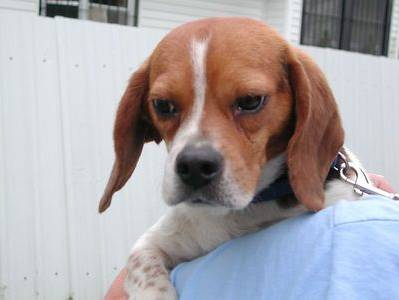

Dog-and-Cat-Recognition-Project
Developed this Machine Learning project to classify the image into Dogs or Cat. Used Various Machine Learning Libraries such as Tenserflow

# Dog vs Cat Convolution Neural Network Classifier

### Problem statement :

In this Section we are implementing Convolution Neural Network(CNN) Classifier for Classifying dog and cat images. The Total number of images available for training and testing is 10,000.
#### Note:This problem statement and dataset is taken from [this](https://www.kaggle.com/c/dogs-vs-cats) Kaggle competition.

### Dependencies
* Jupyter notebook
* Tensorflow 1.10
* Python 3.6
* Matplotlib
* Seaborn
* Scikit-Learn
* Pandas
* Numpy

Install dependencies using [conda](https://conda.io/docs/)

```
import tensorflow as tf
from keras.preprocessing.image import ImageDataGenerator
from PIL import Image
```

## Preprocessing the Training set
```
train_datagen = ImageDataGenerator(rescale = 1./255,
                                   shear_range = 0.2,
                                   zoom_range = 0.2,
                                   horizontal_flip = True)
training_set = train_datagen.flow_from_directory('datasets/dogs_cats/training_set',
                                                 target_size = (64, 64),
                                                 batch_size = 32,
                                                 class_mode = 'binary')
```
## Preprocessing the Test set
```
test_datagen = ImageDataGenerator(rescale = 1./255)
test_set = test_datagen.flow_from_directory('datasets/dogs_cats/test_set',
                                            target_size = (64, 64),
                                            batch_size = 32,
                                            class_mode = 'binary')
```

Network Parameter:
* Rectifier Linear Unit 
* Adam optimizer
* Sigmoid on Final output
* Binary CrossEntropy loss

##  Building the CNN
### Initialising the CNN
```
cnn = tf.keras.models.Sequential()
```

### Step 1 - Convolution
```
cnn.add(tf.keras.layers.Conv2D(filters=32, kernel_size=3, activation='relu', input_shape=[64, 64, 3]))
```
### Step 2 - Pooling
```
cnn.add(tf.keras.layers.MaxPool2D(pool_size=2, strides=2))
```
### Adding a second convolutional layer
```
cnn.add(tf.keras.layers.Conv2D(filters=32, kernel_size=3, activation='relu'))
cnn.add(tf.keras.layers.MaxPool2D(pool_size=2, strides=2))
```
### Step 3 - Flattening
```
cnn.add(tf.keras.layers.Flatten())
```
### Step 4 - Full Connection
```
cnn.add(tf.keras.layers.Dense(units=128, activation='relu'))
```

### Step 5 - Output Layer
```
cnn.add(tf.keras.layers.Dense(units=1, activation='sigmoid'))
```
## Training the CNN

### Compiling the CNN
```
cnn.compile(optimizer = 'adam', loss = 'binary_crossentropy', metrics = ['accuracy'])
```

###  Training the CNN on the Training set and evaluating it on the Test set
```
cnn.fit(x = training_set, validation_data = test_set, epochs = 25)
```

## Part 4 - Making a single prediction
```
import numpy as np
from keras.preprocessing import image
from tensorflow.keras.utils import load_img
from tensorflow.keras.utils import img_to_array
test_image = load_img('datasets/dogs_cats/single_prediction/cat_dog6.jpg', target_size = (64, 64))
pic = Image.open('datasets/dogs_cats/single_prediction/cat_dog6.jpg')
test_image = img_to_array(test_image)
test_image = np.expand_dims(test_image, axis = 0)
result = cnn.predict(test_image)
training_set.class_indices
if result[0][0] == 1:
  prediction = 'dog'
else:
  prediction = 'cat'
```

```
pic.show()
print(prediction)
```
### Output
```
dog
```




## Conclusion
The Architecture and parameter used in this network are capable of producing accuracy of 97.56% on Validation Data which is pretty good. It is possible to Achieve more accuracy on this dataset using deeper network and fine tuning of network parameters for training. You can download this trained model from resource directory and Play with it.
